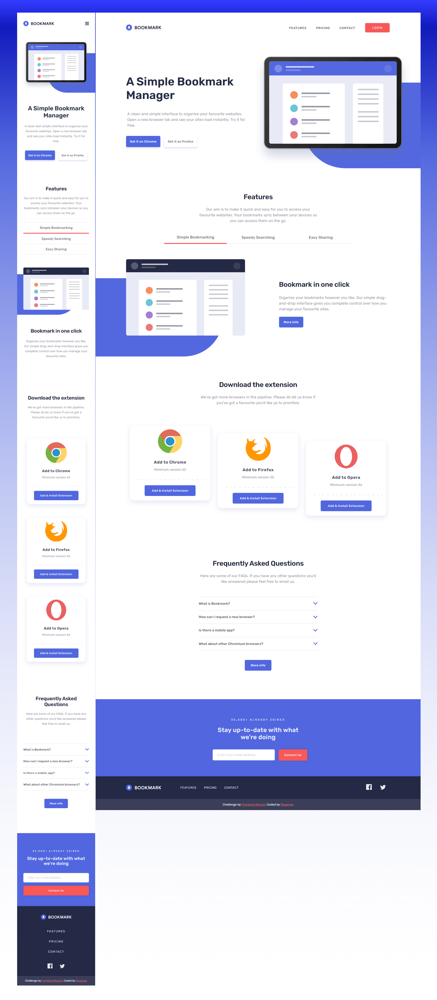

# Frontend Mentor - Bookmark landing page

#### Challenge Preview

# Table of Contents

1. The Challenge
1. Screenshot of My Work
1. My Process
1. Author
1. Acknowledgements

## Overview

### The challenge

Users should be able to:

- View the optimal layout for the site depending on their device's screen size
- See hover states for all interactive elements on the page
- Receive an error message when the newsletter form is submitted if:
  - The input field is empty
  - The email address is not formatted correctly

### Screenshot

### Links

- Solution URL: [Add solution URL here](https://your-solution-url.com)
- Live Site URL: [Add live site URL here](https://rouwe.github.io/bookmark_landing_page/)

## My process

### _Semantic_

I started by creating a sketch on how the general layout of each major section should look like and the semantic HTML elements that I will be needing. I also need to think about how to make the most out of flexbox for mobile and desktop view of the page.

### _User Interface_

The first step that I have done is to make the user interface of the page for the mobile view using HTML and CSS.

### _Interactivity_

The next step is to make the page interactive by using Javascript.
I just repeatedly do the process while also making some minor adjustment.

### Built with

- Semantic HTML5 markup
- CSS custom properties
- Vanilla Javascript
- Flexbox
- Mobile-first workflow

### What I learned

Throughout the process of building this page, I managed to reinforce my knowledge on HTML, CSS and Javascript. Working with SVG is pretty new to me, so I needed to do a some research to make things work. Working with Vanilla JS is challenging and fun as well. The most important thing that I learned is that I still have a lot to learn.

### Continued development

I want to focus more on HTML, CSS, and Javascript.

### Useful resources

- [W3Schools](https://w3schools.com/) - This is helped me a lot when I need some kind of simple and straight to the point reference.
- [Mozilla](https://developer.mozilla.org/en-US/docs/Web) - I used this whenever I needed to dive deeper into some topic.

## Author

- Frontend Mentor - [@Rouwe](https://www.frontendmentor.io/profile/rouwe)

## Acknowledgments

I'm thankful for **Frontend Mentor's** challenges. Since this will allow me to hone my skills further.
